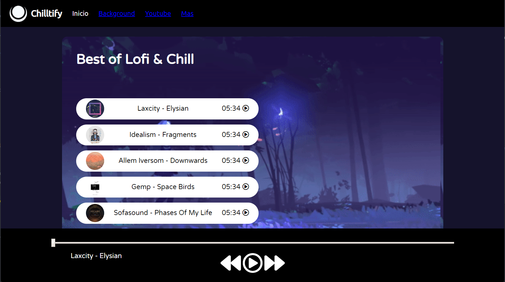
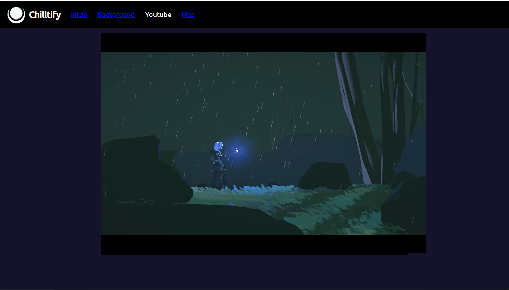

<h1 align="center">🌜 Lofi Music - Diana Sessions 🌛</h1>

  Lofi music application made in electron, based on "Diana Sessions" from Riot Games Music.

 Index
  

  Youtube
  

> This project was made for educational purposes only, and the music originally comes from [Riot Games Music](https://www.youtube.com/c/riotgamesmusic)

# How to install
## Step 1⃣
* Download the project and import it into VS
## Step 2⃣
* Run `npm install`
* Then run `npm start`
## Step 🌳
* That's all

# Download
Available for Mac, Linux and Windows.

Installer `.exe` only available for Windows.

[Windows Installer](https://drive.google.com/uc?export=download&confirm=01yo&id=1jaOdnnbRDlwPOBI3_pnWF0P0E6ASZKUS) |
[Mac Os](https://drive.google.com/drive/folders/1LOYV_qe18X_R_i_79w7tK7rw661Jzd10?usp=sharing) |
[Linux](https://drive.google.com/drive/folders/1_6AQhmQ0W0Uni2w_MwGZR6uMiy_oZVb7?usp=sharing)

# License
💜 [MIT License](/LICENSE)
